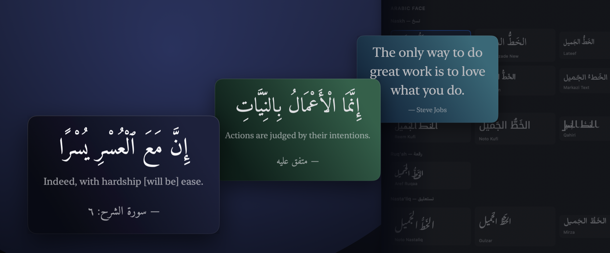
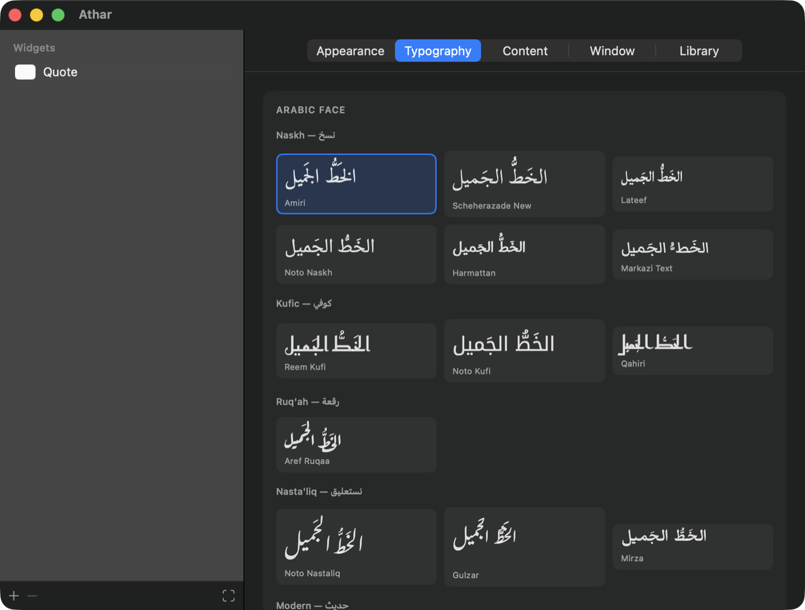
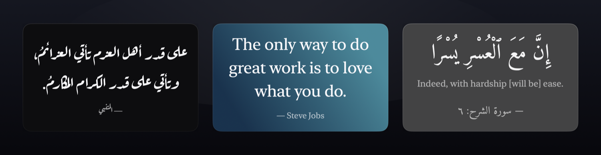
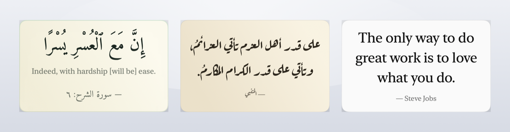
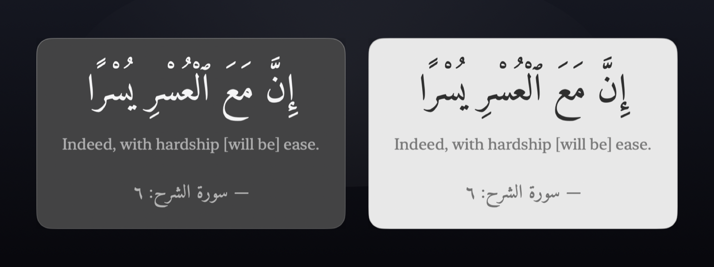
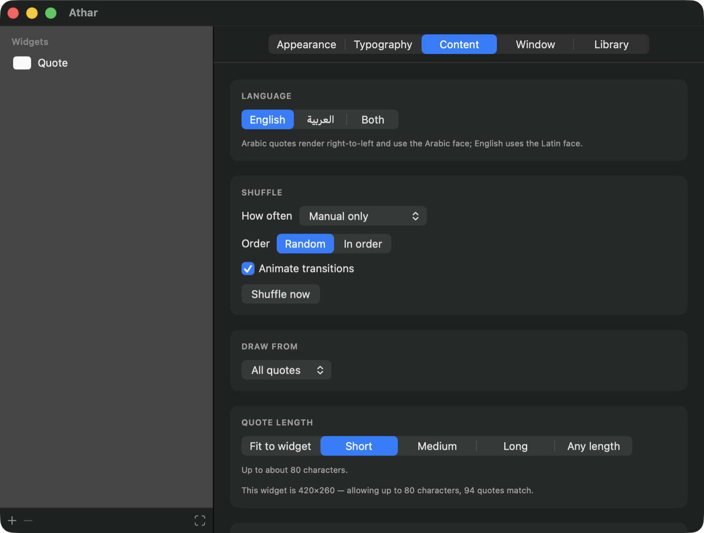
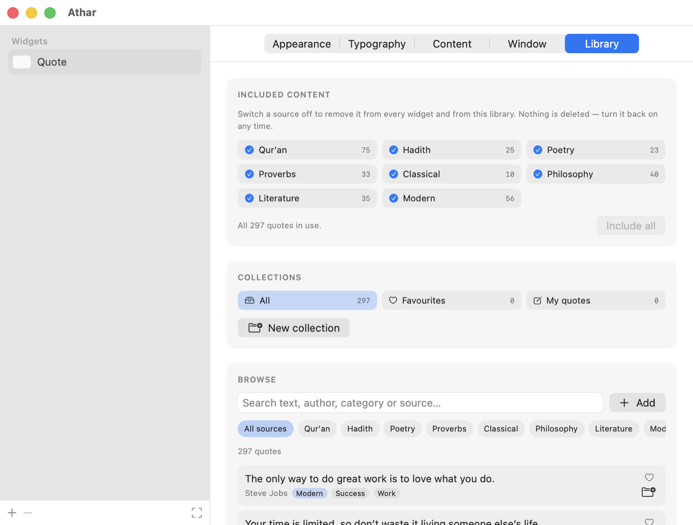

# Athar — أثر

A freely resizable quote widget for the macOS desktop, with a full Arabic
calligraphy type library. Every feature unlocked, no account, no network access.



## Install

Download `Athar.dmg` from [Releases](../../releases) and drag Athar into
Applications. Requires macOS 14 or later.

Athar is signed ad-hoc, so clear the download flag **before** opening it the
first time:

```bash
xattr -dr com.apple.quarantine /Applications/Athar.app
```

Or build it yourself — locally built apps skip that step entirely:

```bash
git clone https://github.com/thehmzr/athar-macos.git && cd athar-macos
./build.sh --install
```

Athar runs from the menu bar. There is no Dock icon.

Uninstall with `rm -rf /Applications/Athar.app ~/Library/Application\ Support/Athar`

## Features

**Resizable.** Drag any edge or corner, from a 160×110 tile to a full-width
banner — text refits itself to whatever size you choose. Multiple independent
widgets, each with its own look and content.

**Placement.** Pinned to the desktop, a normal window, or always on top. Lock
position and size, click through to what's behind, show on every Space.

**Shuffle.** Every 10 seconds to once a day, or manual. Random or sequential.

### Typography

24 Arabic faces across Naskh, Kufic, Ruq'ah, Nasta'liq, display and modern —
Amiri, Scheherazade New, Aref Ruqaa, Reem Kufi, Noto Nastaliq, Cairo and more.
Right-to-left with correct shaping, ligatures and full diacritics.



### Appearance

Ten presets, plus solid, gradient, glass and image backgrounds. Independent
colours for quote, translation, attribution and border.




Glass follows the system appearance — material and text switch together.



### Content

297 quotes — 103 English, 194 Arabic. Qur'an, Hadith, poetry, proverbs,
philosophy and literature, filtered by language, source, category and length.
Arabic scripture carries an English rendering beneath it.



Switch any source off to remove it from every widget in one click. Favourite
quotes, file them into named collections, or write your own.



## Licence

Source released into the public domain under the [Unlicense](LICENSE).

Bundled fonts remain under the SIL Open Font License 1.1. Fonts and text sources
are listed in [CREDITS.md](CREDITS.md).
