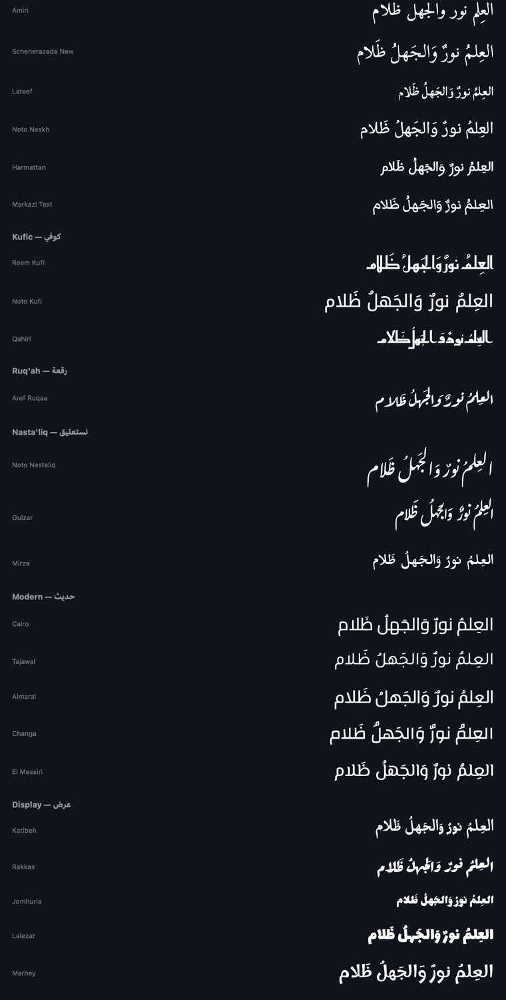

# Athar — أثر

A freely resizable quote widget for the macOS desktop, with a full Arabic
calligraphy type library, Qur'an and Hadith sourced from quran.com, and every
feature unlocked. No paid tier, no account, no network access at runtime.

*Athar* (أثر) means a trace, a mark left behind.


---

## Install

### Download

Grab `Athar.dmg` from the [Releases](../../releases) page, open it, and drag
Athar into Applications. Requires **macOS 14 or later**.

The app is signed ad-hoc rather than notarised, so the first launch may be
blocked. If that happens, clear the quarantine flag:

```bash
xattr -dr com.apple.quarantine /Applications/Athar.app
```

### Or build from source

Requires the Command Line Tools. No Xcode, no package manager, no dependencies.

```bash
xcode-select --install
```

Then build and install to `/Applications`:

```bash
git clone <repository-url> && cd Athar
./build.sh --install
```

That compiles the app, bundles the fonts and quote data, signs it ad-hoc,
copies it to `/Applications` and launches it.

To build without installing:

```bash
./build.sh && open build/Athar.app
```

Athar runs as a **menu-bar app** — look for the quote-bubble icon in the menu
bar. There is no Dock icon and no main window.

Package a disk image of your own build:

```bash
./build.sh --dmg
```

### Uninstall

```bash
rm -rf /Applications/Athar.app ~/Library/Application\ Support/Athar
```

---

## Why a floating panel and not a WidgetKit widget

macOS WidgetKit widgets exist only in fixed families — small, medium, large,
extra-large. There is no arbitrary resizing, by design, and no API to add it. A
WidgetKit extension also requires Xcode to build.

Athar draws each widget as a borderless `NSPanel` pinned to the desktop layer
instead. That is what makes drag-any-edge resizing possible, and it builds with
nothing but the Swift compiler shipped in Command Line Tools.

---

## Using it

| Action | How |
| --- | --- |
| Resize | Drag any edge or corner |
| Move | Drag the top strip, or anywhere on the background |
| Shuffle, favourite, copy, settings | Hover over the widget |
| Open settings | Menu bar icon → Settings, or `⌘,` |

Text resizes with the widget: a binary search finds the largest point size at
which the quote, its translation and its attribution all still fit, so the
widget stays readable from a 160×110 corner tile up to a full-width banner.

---

## Features

**Layout**

- Freely resizable from 160×110 upward — no fixed size families
- Multiple independent widgets, each with its own look and content
- Three layers: pinned to desktop, normal window, or always on top
- Lock position and size, click-through, per-widget opacity, show on every Space
- Frames persist across launches and are clamped back on-screen if a display is
  disconnected

**Shuffle**

- Intervals from every 10 seconds to once a day, or manual only
- Random (never repeats twice running) or sequential
- Animated cross-fade between quotes

**Arabic typography**

24 bundled faces, grouped by calligraphic school:

| School | Faces |
| --- | --- |
| Naskh — نسخ | Amiri, Scheherazade New, Lateef, Noto Naskh, Harmattan, Markazi Text |
| Kufic — كوفي | Reem Kufi, Noto Kufi, Qahiri |
| Ruq'ah — رقعة | Aref Ruqaa |
| Nasta'liq — نستعليق | Noto Nastaliq Urdu, Gulzar, Mirza |
| Display — عرض | Katibeh, Rakkas, Jomhuria, Lalezar, Marhey, Vibes |
| Modern — حديث | Cairo, Tajawal, Almarai, Changa, El Messiri |

Arabic renders right-to-left with correct shaping, ligatures and full diacritics.

Each face carries a calibrated line-height target, because intrinsic metrics
vary enormously across Arabic type — Gulzar's natural line height is 2.70× its
point size while Jomhuria's is 1.00×. Leading is computed as the *difference*
between the target and the face's real metrics, so Nasta'liq does not
double-count its own generous spacing and collapse into stripes.

Letter-spacing is applied to Latin text only and is always exactly zero for
Arabic. Arabic is a connected script: spacing the glyphs apart breaks the joins
that define the letterforms.

Every face previews in its own type, grouped by school:




**Appearance**

- 10 presets, including Mushaf and Parchment for Arabic text
- Solid, gradient (any angle), glass and image backgrounds
- Glass optionally follows the system Light/Dark appearance — the material and
  the text palette switch together, so text never ends up light-on-light
- Independent colours for quote, translation, attribution and border
- Corner radius, padding, border, shadow, background opacity
- Shadow depth scales with the widget's layer: a desktop-pinned widget gets a
  contact shadow, an always-on-top one gets a deep drop shadow


Glass can follow the system appearance. The material and the text palette switch
together, so text never ends up light-on-light:


**Content**

297 quotes — 103 English, 194 Arabic.

Organised on three axes that compose independently rather than one flat tag list:

| Axis | Values |
| --- | --- |
| Language | English, العربية, or both |
| Source | Qur'an 75 · Hadith 25 · Poetry 23 · Proverbs 33 · Classical 10 · Philosophy 40 · Literature 35 · Modern 56 |
| Category | Faith, Wisdom, Motivation, Life, Knowledge, Patience, Love, Success, Work, Time, Self, Friendship, Hope |

Categories are bilingual by construction — selecting "Patience" also matches
صبر, which free-string tags cannot do. Leaving an axis empty means "no
restriction on that axis", so Source and Category narrow independently.

A **quote length** control keeps long verses off small widgets. Left on *Fit to
widget*, the limit is derived from the widget's own area, so a 260×200 tile
asks for short quotes while a banner accepts long ones.


**Choosing what's included**

Library → *Included content* has a switch per source. Turning one off removes it
from every widget and from the library in one click — useful if you don't want
the Qur'an or Hadith sets, for example. Nothing is deleted; switch it back on at
any time, or press **Include all**. Everything ships enabled by default.


**Collections and favourites**

- Favourite any quote from the widget itself or the Library
- Create named folders and file quotes into them
- Point a widget at All quotes, Favourites, or one collection, then narrow
  further by source, category and length
- Write your own quotes in either language, with their own source, categories
  and optional English meaning
- Search across text, translation, author, category and source

**Accessibility**

Reduce Transparency turns glass into a solid surface. Reduce Motion keeps the
cross-fade between quotes, which aids comprehension, and drops the scale, which
is the part that moves.

---

## Text and typography notes

Qur'anic verses are complete verses in the Uthmani script, kept short enough to
remain readable in a widget, and set in the traditional ornate brackets ﴿ ﴾
rather than quotation marks. Each carries its surah and ayah reference.

Hadith carry their collection as the attribution, in the vocalised text.

English renderings of Arabic scripture appear beneath it at roughly the size of
the reference line and in a quieter tone — a gloss to read if you look for it,
not a second quote competing with the verse. It is dropped automatically when a
widget is too small to render it legibly.

Sources and licences for the fonts and texts are listed in [CREDITS.md](CREDITS.md).

---

## Self-checks

`--diagnose` confirms the bundle resolved its fonts and quote data.
`--test-filters` confirms every quote a filter returns actually satisfies that
filter, and exits non-zero on failure.

```bash
/Applications/Athar.app/Contents/MacOS/Athar --diagnose
/Applications/Athar.app/Contents/MacOS/Athar --test-filters
```

---

## Source layout

```
Sources/
  App.swift                     @main, menu bar, first run, --diagnose
  Models/
    Quote.swift                 Quote, Category, Source, Collection, Language
    QuoteLibrary.swift          Loading, filtering, ShuffleEngine
    Settings.swift              WidgetConfig, AppSettings, persistence
    FontCatalog.swift           Font catalogue, metric-aware leading
    Theme.swift                 RGBA, backgrounds, presets, light/dark palettes
    Typography.swift            Vertical rhythm, tracking rules, system prefs
  Windows/
    WidgetPanel.swift           Borderless NSPanel, resize chrome, frame persistence
    PanelController.swift       Panel lifecycle, WidgetRuntime, shuffle timers
    SettingsWindowController.swift
  Views/
    QuoteWidgetView.swift       TextFitter and the widget itself
    SettingsView.swift          Appearance / Typography / Content / Window
    LibraryTab.swift            Browse, search, favourite, author quotes
Resources/
  Fonts/                        24 Arabic families, SIL OFL
  Data/                         Quote sets as JSON
Tools/                          Development utilities, not part of the app
```

Settings are stored at `~/Library/Application Support/Athar/settings.json`.

`WidgetConfig` and `Theme` decode field by field, each falling back to its own
default. Synthesized `Codable` throws on the first missing key, which — combined
with a `try?` around the load — would silently reset every widget, layout and
theme the moment a new field is added. A partial or older settings file keeps
everything it does contain and ignores what it does not.

---

## Development

Render the widget and a full type specimen offscreen, without needing screen
recording permission:

```bash
SRC=(); while IFS= read -r l; do SRC+=("$l"); done < <(find Sources -name '*.swift' ! -name 'App.swift' | sort)
swiftc -target arm64-apple-macosx14.0 -swift-version 5 \
  -framework AppKit -framework SwiftUI -framework ServiceManagement \
  "${SRC[@]}" Tools/RenderHarness.swift Tools/main.swift -o build/harness
./build/harness
```

Output lands in `build/preview`. Regenerate the app icon with `Tools/Icon`.

---

## Licence

Application source is released into the public domain under the Unlicense — see
[LICENSE](LICENSE). Bundled fonts remain under the SIL Open Font License 1.1;
see [CREDITS.md](CREDITS.md) for fonts, texts and their terms.
